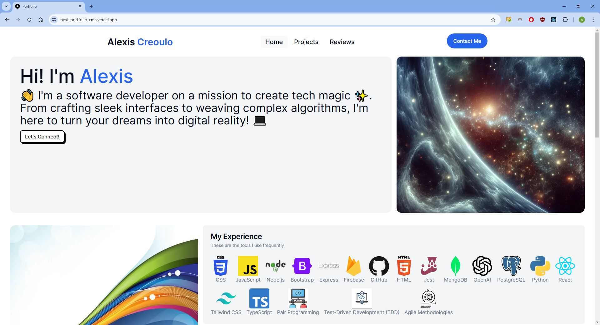
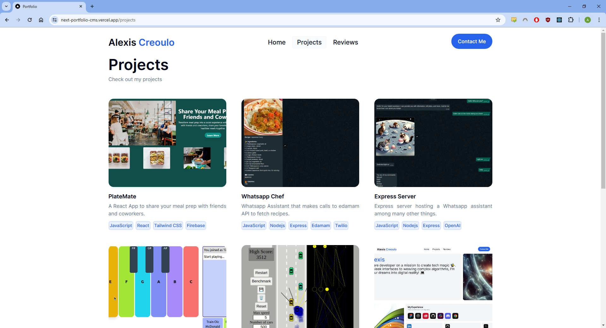
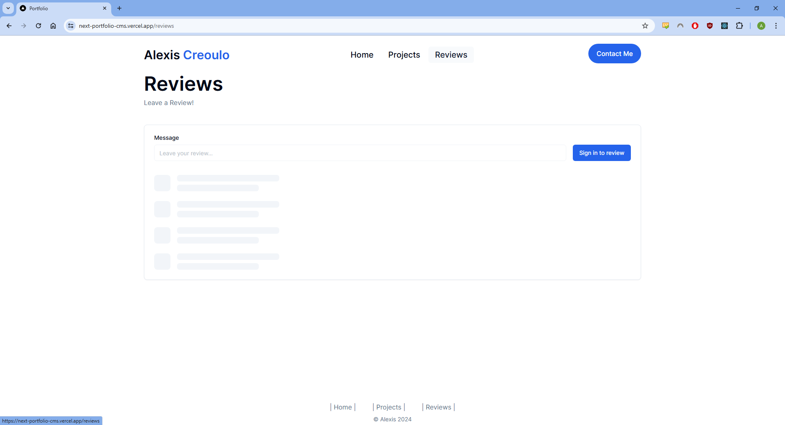
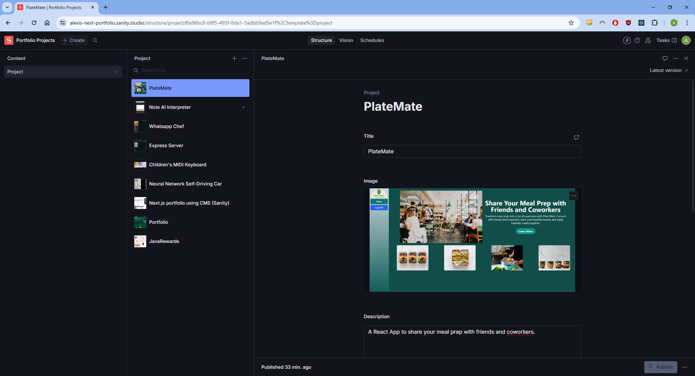

# Portfolio Website

Featuring:
- Next.js
- Kinde(authentication)
- Supabase
- Sanity (CMS)
- TailwindCSS
- Shadcn UI components

<figure>
  
  <figcaption>Home screen</figcaption>
</figure>

<figure>
  
  <figcaption>Projects loaded from Sanity (CMS)</figcaption>
</figure>

<figure>
  
  <figcaption>Skeleton when fetching data from database</figcaption>
</figure>

<figure>
  
  <figcaption>Easily upload more projects through Sanity Studio</figcaption>
</figure>